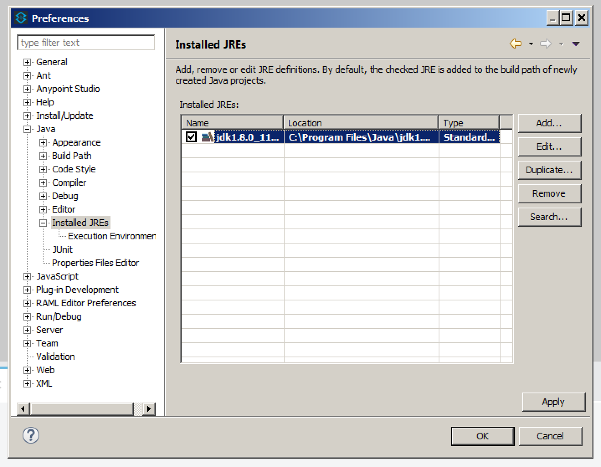
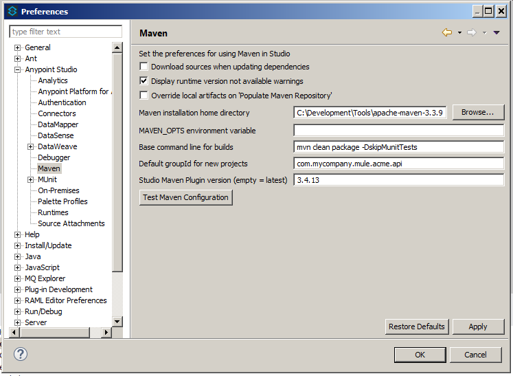
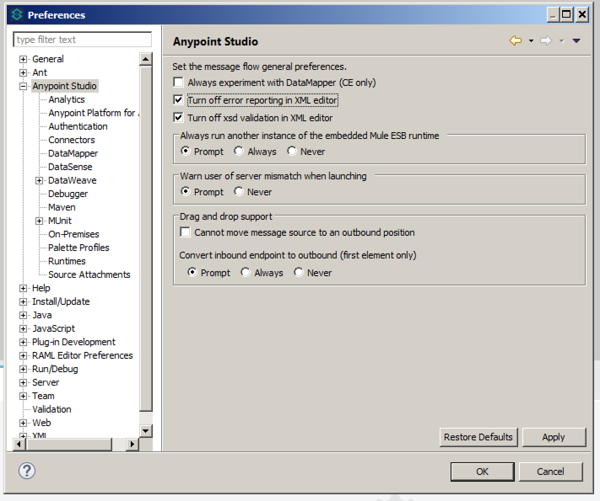
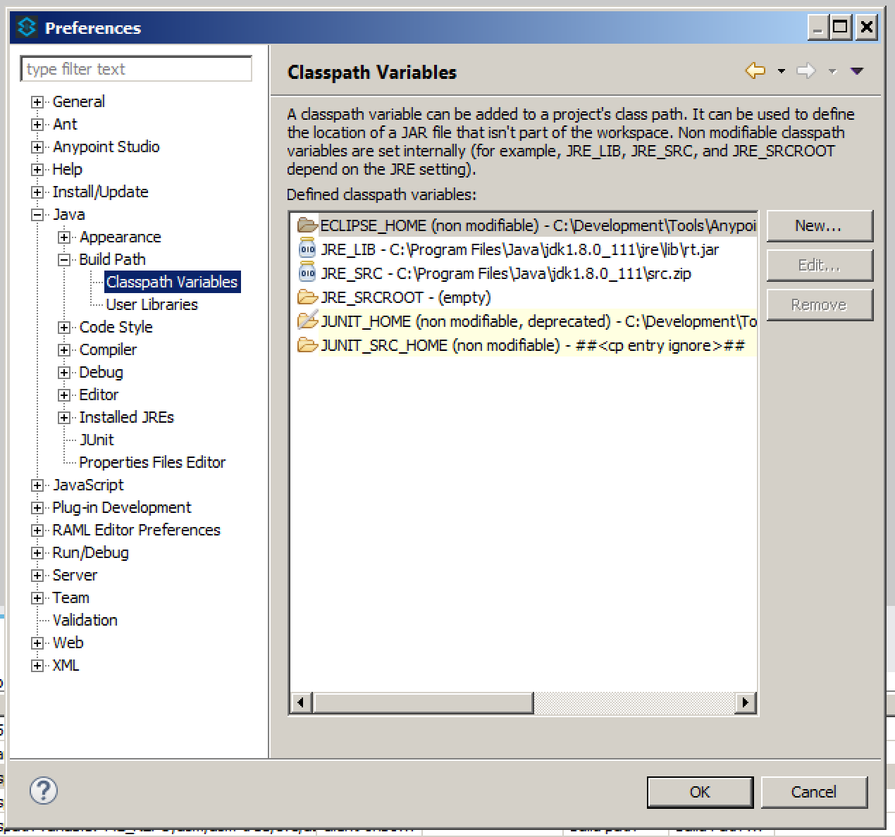
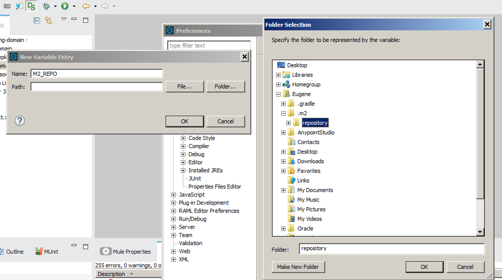
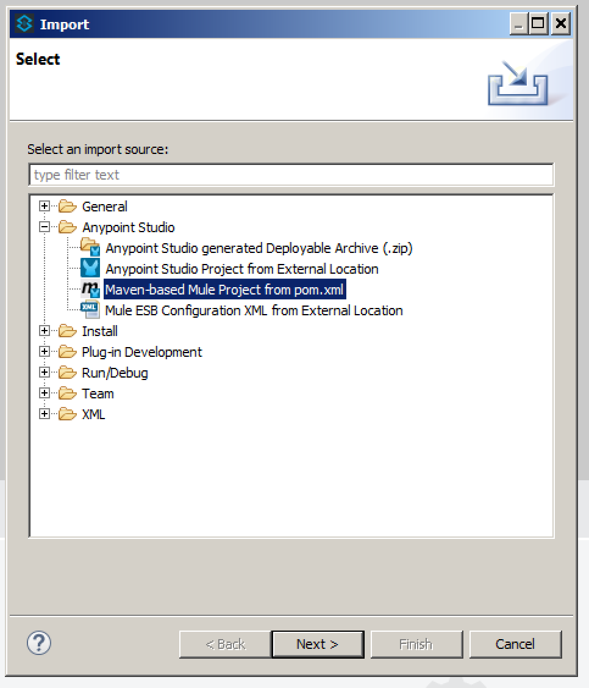
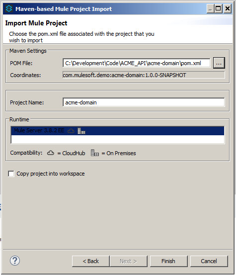
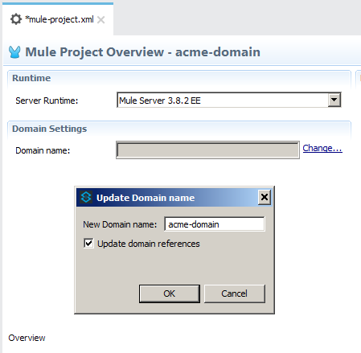
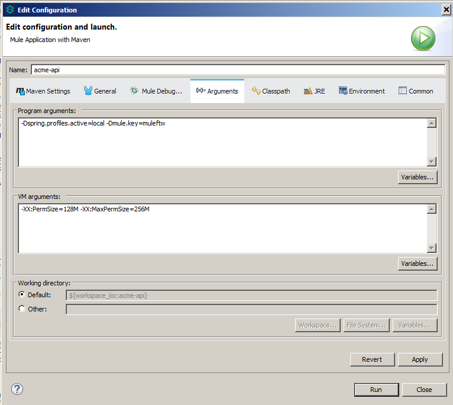

= ACME API Project

== Setting Up the Dev Environment

==== JDK
Download and install the latest version of *Oracle JDK 1.8* for your OS from
http://www.oracle.com/technetwork/java/javase/downloads/jdk8-downloads-2133151.html

IMPORTANT: You must use full *JDK*, not *JRE*!

Create the `JAVA_HOME` *system* variable  pointing to your JDK, e.g. `JAVA_HOME=C:\Program Files\Java\jdk1.8.0_111`. +
Add the path to the `java` executable to your `Path`, e.g. `Path=%JAVA_HOME%\bin;...`

==== Maven
Download and install the latest version of *Apache Maven* from https://maven.apache.org/download.cgi

Unpack the distribution to e.g. `C:\Development\Tools` and create the `M2_HOME` system variable pointing to the Apache Maven root directory,
e.g. `M2_HOME=C:\Development\Tools`.

Add the path to the `mvn` executable to your `Path`, e.g. `Path=%M2_HOME%\bin;...`

Edit the `%M2_HOME%\conf\settings.xml` and make sure the `<pluginGroups>` element is configured as follows:
-------------
  <pluginGroups>
      <pluginGroup>org.mule.tools</pluginGroup>
      <pluginGroup>org.mule.tools.maven</pluginGroup>
      <pluginGroup>org.mule.tooling</pluginGroup>
  </pluginGroups>
-------------

==== Git
Download and install the latest version of *GitHub Desktop* from https://desktop.github.com/
Download and install the command line *git* from https://git-scm.com/download/win . When installing, select the *"Use Git from the Windows Command Prompt"* option,
*"Checkout as-is, commit Unix-style endings"* option, leave other options as-is.

Open the command prompt (`cmd`), navigate to the directory where your code will reside (e.g. `C:\Development\Code`) and clone the *ACME_API* repository using the following command:

`C:\Development\Code>git clone http://<user>:<password>@github.com/demo/acmeapi.git`

where `<user>` and `<password>` are your git credentials.

Open the *GitHub Desktop* application, click the '+' button at the upper left corner, select the *Add* tab and browse to the location of the local repository, e.g.
`C:\Development\Code\ACME_API`.

==== Anypoint Studio

Download and install the latest version of Anypoint Studio from the Support Portal (see Pavel for details). Configure it as follows:

* Open *Window->Preferences* dialog, select *Java->Installed JREs*, and add the JDK 1.8. Make sure it is selected as default.

* Select *Anypoint Studio->Maven*, add values for the Maven installation home directory, configure default Maven groupId (e.g. `com.mycompany.mule.acme.api`) and set the Studio Maven plugin version to *3.4.13* (since the latest version has an issue with importing domain projects).

* Select *Anypoint Studio* and check the *Turn off error reporting in XML editor* checkbox.

* Select *Java->Build Path->Classpath Variables*

* If the `M2_REPO` variable is missing, add it by clicking *New...*, and in the following dialog set the name to `M2_REPO` and the path to the Maven repository folder, normally located in `<user home>/.m2/repository`,
e.g. `C:\Users\JohnDoe\.m2\repository`. If the directory does not exist, create it.

==== Importing Projects

Open *File->Import...* dialog, select *Anypoint Studio->Maven-based Mule Project from pom.xml*:

Select the `pom.xml` file of the `acme-domain` project.

IMPORTANT: Make sure the *Copy project into workspace* checkbox is *not checked*.

Repeat the process for all remaining projects in the workspace.

Open `acme-domain/mule-project.xml`, click *Change...* and set the name to the `acme-domain`.

==== Running Projects

The `-Dspring.profiles.active=...` and `-Dmule.key=...` parameters must be set when running any of the APIs.

== Project Modules
[cols="asciidoc,asciidoc",options="header"]
|===================================================
|Project Module|Description
|`acme-api`|The business layer REST API which is called by an experience API and orchestrates calls to the underlying system APIs.
|`acme-resources`|Contains *all* common custom Java classes, RAML definitions, mappings, schemas and examples. All API modules include this module as a dependency.
|`acme-domain`|Shared HTTP listener to be used by all APIs. +
See https://docs.mulesoft.com/mule-user-guide/v/3.8/shared-resources
|`acme-system-one-api`|The SystemOne API.
|`acme-system-two-api`|The SystemTwo API.
|===================================================

== Naming Convention

[cols="asciidoc,asciidoc,asciidoc",options="header"]
|===================================================
| |Format |Examples

|*System API projects*:

|Project names are lowercase, hyphen- or underscore-separated. The format is: +
 +
`acme-system-&lt;system-name&gt;-api`  +
   +
where `&lt;system-name&gt;` is one of:

   - `one` +
   - `two` +
   etc.

|`acme-system-one-api`

|*XML files*:
|Application XML file names are hyphen- or underscore-separated. The format is:  +
  +
`&lt;system-name&gt;-<resource>-impl.xml`  +
  +
where `&lt;system-name&gt;` is one of:

   - `system-one` +
   - `system-two` +
   etc.

and `<resource>` is one of:

   - `widget` +
   - `gadget` +

|`system-one-widget-impl.xml`

|*Flows*:
|Flow names are camel-case. When flows in multiple XML files are cross-referenced, name of the flow may be prepended with the name of the XML. Sub-flows may have an underscore `_` as a first character in the name when used as utility functions. The format is: +
 +
`&lt;xml-file-name&gt;.&lt;operation-name&gt;` +
 +
*NOTE: This does not apply to the flows generated by the Scaffolding actions.*
|`one-widget-impl.create`

|*Mapping files*:
|`&lt;system-name&gt;-&lt;operation&gt;-&lt;request/response&gt;.dw`
|`one-create-widget-request.dw` +
`two-update-gadget-response.dw`

|*Properties files*:
|`&lt;project-name&gt;.&lt;environment&gt;.properties`
|`acme-api.dev.properties` +
`acme-system-one-api.prod.properties`

|*Flow variables*:
|Flow variables are camel-case, optionally prepended with underscore.
|`_counter` +
`customerID`

|===================================================

== Coding Style

=== Encoding
All XML files must be UTF-8 encoded. Always use the following XML declaration:

 <?xml version="1.0" encoding="UTF-8"?>

Always use UNIX-style line endings.

=== Indentation

XML indentation is 4 whitespaces. Do not use TAB and make sure all tabs are converted to spaces (soft tabs). All nested tags and code within CDATA blocks must use the same indentation.

----------------------------------
<foreach>
    <expression-component>
        <![CDATA[
            flowVars["testVar"] = "HelloWorld";
        ]]>
     </expression-component>
 </foreach>
----------------------------------

=== Vertical Spacing

Separate semantically unrelated parts of the flow vertically by one blank line.

-----------------------------------------------------------------------------
<flow name="contract.GenerateContract>

    <flow-ref name="util.EnrichCustomerData"/>

    <set-variable variableName="customerId" value="#[message.payload['CustomerId']]"/>
    <set-variable variableName="filename" value="Contract.pdf" />
    <set-variable variableName="folderName" value="#[message.payload['PartnerName']]"/>

</flow>
-----------------------------------------------------------------------------

Separate flows from each other by single blank line and an optional line of comments.

=== Line Wrapping

Break long tags with single new line character; indent second line of attributes so that it is positioned right under the first attribute of the XML element on the line above.

.Correct:
-----------------------------------------------------------------------------
<x12-edi:config name="GenericEDI" invalidCharacterInValueFail="false"
                unknownsSegmentFail="false" valueLengthErrorFail="false"
                wrongSegmentsRepeatsFail="false"
                wrongValuesRepeatsFail="false" stringCharacterSet="UNRESTRICTED" doc:name="X12 EDI">
    <x12-edi:schemas>
        <x12-edi:schema>/x12/005010/834.esl</x12-edi:schema>
    </x12-edi:schemas>
</x12-edi:config>
-----------------------------------------------------------------------------

.Incorrect:
-----------------------------------------------------------------------------
<x12-edi:config name="GenericEDI" invalidCharacterInValueFail="false" unknownsSegmentFail="false"         valueLengthErrorFail="false" wrongSegmentsRepeatsFail="false"
wrongValuesRepeatsFail="false" stringCharacterSet="UNRESTRICTED" doc:name="X12 EDI">
    <x12-edi:schemas>
        <x12-edi:schema>/x12/005010/834.esl</x12-edi:schema>
    </x12-edi:schemas>
</x12-edi:config>
-----------------------------------------------------------------------------

=== Comments

Use XML comments instead of doc:name and doc:description attributes to improve code readability.

When multiple nested flow control elements such as `<choice>`, `<foreach>`, etc. are used, add comment next to the closing tag of each nested element.

-----------------------------------------------------------------------------
<foreach counterVariableName="counterVar"> <!-- carriers -->

   <choice> <!-- Is carrier configured for aggregation -->
        <when expression="#[flowVars['carriersList'].contains(flowVars['carrierName'])]"> <!-- carrierList contains carrierName -->

            <choice> <!-- first counters -->
                <when expression="#[flowVars['counterVar'] == 1]"> <!-- counter is 1 -->
                        ...
                </when> <!-- counter is 1 -->
                <when expression="#[flowVars['counterVar'] == 2]"> <!-- counter is 2 -->
                        ...
                </when> <!-- counter is 2 -->
                <otherwise> <!-- counter is greater than 2 -->
                        ...
                </otherwise> <!-- counter is greater than 2 -->
            </choice> <!-- first counters -->

        </when> <!-- carrierList contains carrierName -->
        <otherwise> <!-- carrierList does not contain carrierName -->
                ...
        </otherwise> <!-- carrierList does not contain carrierName -->
    </choice> <!-- Is carrier configured for aggregation -->

</foreach> <!-- carriers -->
-----------------------------------------------------------------------------

== Structure

=== Top `<mule>` Tag

Top `<mule>` tag contains all namespace and schema location declarations.  The namespaces must be declared before schema locations. Each namespace and schema location declaration must start with new line and proper indentation.

.Correct:

----------------------------------------------------------------------------------------------------------------------------------------------------------
<mule xmlns="http://www.mulesoft.org/schema/mule/core"
      xmlns:sfdc="http://www.mulesoft.org/schema/mule/sfdc"
      xmlns:doc="http://www.mulesoft.org/schema/mule/documentation"
      xmlns:spring="http://www.springframework.org/schema/beans"
      xmlns:xsi="http://www.w3.org/2001/XMLSchema-instance"
      xsi:schemaLocation="
        http://www.mulesoft.org/schema/mule/sfdc http://www.mulesoft.org/schema/mule/sfdc/current/mule-sfdc.xsd
        http://www.springframework.org/schema/beans http://www.springframework.org/schema/beans/spring-beans-current.xsd
        http://www.mulesoft.org/schema/mule/core http://www.mulesoft.org/schema/mule/core/current/mule.xsd
">
----------------------------------------------------------------------------------------------------------------------------------------------------------

.Incorrect:

----------------------------------------------------------------------------------------------------------------------------------------------------------
<mule xmlns="http://www.mulesoft.org/schema/mule/core" xmlns:sfdc="http://www.mulesoft.org/schema/mule/sfdc" xmlns:doc="http://www.mulesoft.org/schema/mule/documentation" xmlns:spring="http://www.springframework.org/schema/beans"        xmlns:xsi="http://www.w3.org/2001/XMLSchema-instance" xsi:schemaLocation="
http://www.mulesoft.org/schema/mule/sfdc http://www.mulesoft.org/schema/mule/sfdc/current/mule-sfdc.xsd http://www.springframework.org/schema/beans http://www.springframework.org/schema/beans/spring-beans-current.xsd http://www.mulesoft.org/schema/mule/core http://www.mulesoft.org/schema/mule/core/current/mule.xsd">
----------------------------------------------------------------------------------------------------------------------------------------------------------

=== Global Declarations

Global declarations include, but not limited to:

- connector configs;
- spring beans;
- properties placeholders;
- processing strategies.

It is recommended to keep all global declarations in a separate XML file (e.g. `global.xml` or `common.xml`)

Separate unrelated global declarations vertically by one blank line.
----------------------------------------------------------------------------------------------------------------------------------------------------------
<secure-property-placeholder:config name="Secure_Property_Placeholder"
                                    encryptionAlgorithm="Blowfish"
                                    key="${lookup.key}"
                                    location="processenrollments.${mule.env}.properties"/>

<sfdc:config name="Salesforce__Config" username="${Salesforce_User}" password="${Salesforce_Pwd}"
             securityToken="${Salesforce_SecurityToken}"
             url="${Salesforce_Url}" disableSessionInvalidation="true">
    <reconnect-forever frequency="5000" />
</sfdc:config>
----------------------------------------------------------------------------------------------------------------------------------------------------------

== Syntax and Best Practices
=== MEL Expressions
==== Flow Variables, Properties, Lists and Maps

Access Map or List element by the key using square brackets `[]`.

.Correct:

 flowVars['counter']

 message.payload['userId']

 message.inboundProperties['params'][0]

.Incorrect:

 flowVars.counter

 payload.'userId'

 message.inboundProperties.'params'(0)

==== Mule Message

Always use `message.payload` instead of `payload`.

.Correct:

 <set-payload value="#[message.payload['body']]" />

.Incorrect:

 <set-payload value="#[payload.Body]" />

==== Message Properties

Use `<set-property>` instead of `<message-properties-transformer>`.

.Correct:

 <set-property propertyName="header" value="foobar"/>

.Incorrect:

 <message-properties-transformer>
     <add-message-property key="header" value="foobar"/>
 </message-properties-transformer>

==== Session Properties

IMPORTANT: *Do not use session properties!* The concept of session is not well defined in mule, the session properties are serialized  and added to message headers when dispatched over HTTP or JMS, greatly increasing the size of the message and consuming the traffic. *Always use flow variables to pass values between flows.*

